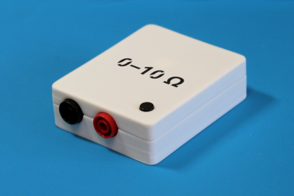

# Continuity Tester

Yet another continuity tester. Digital multimeters are very good at presice
measurements, but usually not so good at continuity testing. This little
tester solves the problem.

- **Open terminals voltage is 100 mV, short terminals current is 100 μA.**
  Suitable for in-circuit measurement (keep p-n juntions closed) without the
  risk of damaging sensitive components.

- **Resistance-dependent beeper tones with chromatic steps.**
  Audible feedback avoid moving your viewpoint. Discrete chromatic steps make
  it easier to determine resistance by ear. The range is 0–10 Ω with 1 Ω steps.

- **Detects shorts of 2 ms with ensured minimal beep duration of 100 ms.**
  Suitable for finding connections by sweeping and brushing without the risk
  of missing a beep. Gold-plated probes are recommended.

- **Auto hold the minimal resistance.**
  Helps against unstable contacts, e.g. on dirty, oxidized, or lacquered
  boards. The hold resets when resistance became more than 10 Ω.

- **200 working hours on a single CR2032 cell.**
  Consumes 0.7 mA when on (+0.3 mA when beeping), 0.1 μA when off. After 3
  minites of inactivity, the tester switched off automatically.

- **Test points for measuring the amplifed resistance signal.**
  In case you want more precise measurements, connect a voltmeter to the
  dedicated test points. This tester isn't a calibrated ohmmeter, so this
  should be used only for relative measurements. Voltage scale on the test
  points is approx. 100 mV/Ω. An analog voltmeter is recommended here.

- **±30 V input protection.**
  The tester should not be used on a powered circuit, but just in case.
  Also saves against charged capacitors. The input impedance of the tester is
  1 kΩ, so the risk of damaging an accidentally powered circuit under test is
  also low.

